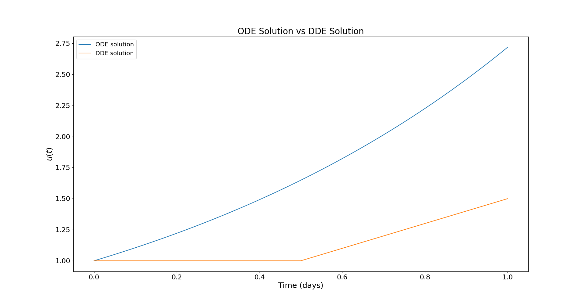
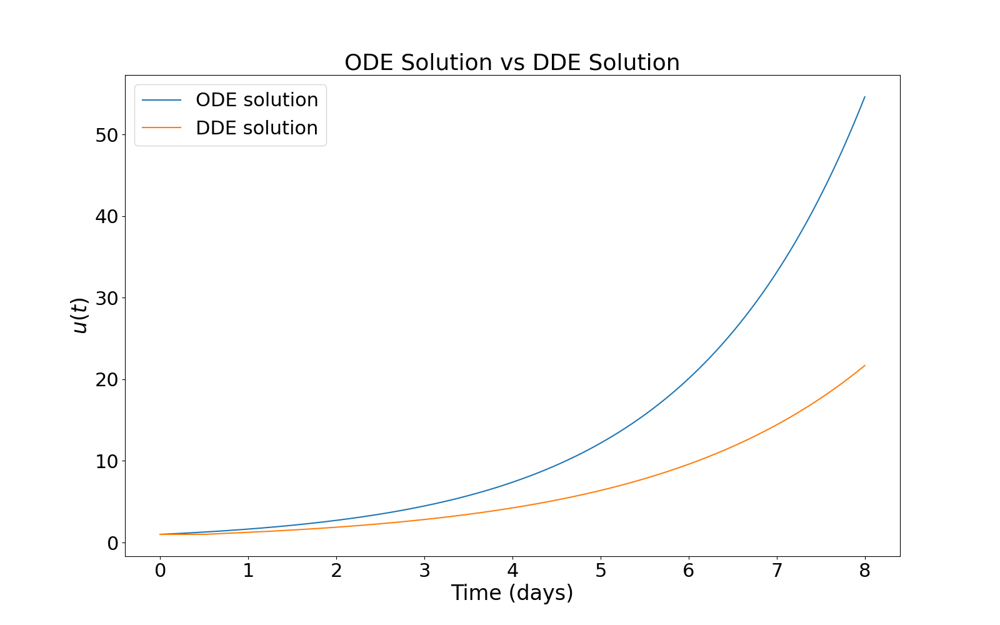

# Delayed Volatility Response to Market Stress

When the stock market falls, volatility often rises. However, the response to a market shock may not occur all at once. Part of the effect may unfold over the following days as investors adjust their positions, hedge risk and respond to new information. Delay differential equations (DDEs) provide a natural way to model this delayed response, capturing propagation effects that standard memoryless ordinary differential equation (ODE) or partial differential equation (PDE) models often miss.

For ODEs, the exponential function plays a fundamental role. As a deliberately simplified benchmark for an immediate volatility response, consider

$$\frac{du(t)}{dt}=au(t), \quad a>0,$$

where $u(t)$ represents a measure of volatility and $a$ is a growth parameter. The solution of this equation is

$$u(t)=u(0)e^{at}.$$

This solution describes how the effect of the initial condition evolves over time. Although this model is too simple to be realistic on its own, it provides a useful benchmark in that the current rate of change depends only on the current volatility value. 

For DDEs, the analogous delay model is 

$$ \frac{du(t)}{dt}=bu(t-\tau), \quad b>0,$$

where $\tau>0$ is a delay parameter. In this case, the current rate of change depends on the past value, which captures the idea that volatility may respond to previous market conditions after a time lag. The solution of this equation with $u(t)=0$ for $t<0$ and $u(0)=1$ is given by 

$$u(t)=\sum_{n=0}^\infty\frac{b^n(t-n\tau)^n}{n!}\Theta\left(t-n\tau\right),$$

where $\Theta(t)$ is the Heaviside function that is defined to be zero for $t<0$ and one for $t\ge 0$. The below plots illustrate the dynamics of the aforementioned solutions over different time periods.

Small Time Dynamics            |  Large Time Dynamics
:-------------------------:|:-------------------------:
  |  

The plots above highlight the key modelling distinction between the ODE and DDE approaches. In the ODE model, the response begins immediately because the current rate of change depends on the current value \(u(t)\). In contrast, the DDE solution remains flat until the delay period has passed, after which the response begins to propagate. The delay model therefore does not simply change the size of the response; it changes the **timing** of the response.

This distinction is useful in a financial setting. A standard non-delay model can test whether volatility reacts to a market shock at the same time the shock occurs. A delay model can instead test whether part of the volatility response appears after a lag. In other words, the non-delay model captures an immediate reaction, whereas the delay model captures delayed propagation.

The empirical question is therefore:

$$
\textit{When the equity market falls, is the VIX response immediate, or is part of the response delayed?}
$$

This question is deliberately narrow. The purpose of the model is not to build a complete volatility forecasting system. Rather, the aim is to demonstrate how delay-equation thinking can provide a simple and interpretable way to measure the timing of stress transmission in financial markets.

To test this idea using real market data, I use the VIX as a measure of implied equity-market volatility and the S&P 500 as a measure of the underlying equity market.

Let

$$
x_t = \log(VIX_t)
$$

denote the log of the VIX on trading day \(t\). I use log-VIX rather than VIX directly because VIX is positive, and changes in volatility are often easier to interpret on a relative scale.

The daily change in log-VIX is

$$
\Delta x_t = x_t - x_{t-1}.
$$

Next, let \(P_t\) denote the S&P 500 level on day \(t\). The daily log-return is

$$
r_t = \log(P_t) - \log(P_{t-1}).
$$

Since volatility tends to rise most strongly when the equity market falls, I define a downside stress variable by

$$
S_t = \max(-r_t,0).
$$

This means that \(S_t\) is positive only on days when the S&P 500 falls. For example, if the market rises, then \(S_t=0\). If the market falls by approximately \(2\%\), then \(S_t \approx 0.02\).

The non-delay model is

$$
\Delta x_t = c + \alpha S_t + \varepsilon_t.
$$

This model asks whether today's equity-market stress explains today's change in VIX. It is the immediate-response benchmark.

The delay model is

$$
\Delta x_t = c + \alpha S_{t-d} + \varepsilon_t,
$$

where \(d\) is a delay measured in trading days. This model asks whether today's change in VIX is better explained by equity-market stress from \(d\) days ago.

The case \(d=0\) corresponds to the non-delay model. The cases \(d=1,2,\ldots,10\) correspond to delayed-response models. By comparing these models, we can estimate the delay horizon at which equity-market stress has the strongest relationship with changes in VIX.

The key output is therefore not just a forecast. It is an interpretable estimate of **timing**. If the best model occurs at \(d=0\), then the evidence suggests that the VIX response is mostly immediate. If the best model occurs at \(d>0\), then the evidence suggests that part of the volatility response is delayed.

---

## Model Comparison

For each delay

$$
d = 0,1,2,\ldots,10,
$$

I fit the model

$$
\Delta x_t = c + \alpha S_{t-d} + \varepsilon_t
$$

and evaluate its out-of-sample performance.

The point \(d=0\) is the non-delay model. Values \(d>0\) correspond to delayed models.

The main comparison is therefore:

| Model | Equation | Interpretation |
|---|---|---|
| Non-delay model | \(\Delta x_t = c + \alpha S_t + \varepsilon_t\) | Today's VIX change depends on today's equity stress |
| Delay model | \(\Delta x_t = c + \alpha S_{t-d} + \varepsilon_t\) | Today's VIX change depends on equity stress from \(d\) days ago |

The non-delay model asks:

$$
\textit{Does VIX respond to equity-market stress today?}
$$

The delay model asks:

$$
\textit{Does VIX respond most strongly to equity-market stress after a delay?}
$$

This is the main benefit of the delay model. It does not merely estimate whether equity stress matters. It estimates **when** that stress appears most strongly in volatility.

---

## Plot 1: VIX and Downside Equity Stress

The first empirical plot shows the raw market intuition by comparing the VIX with downside S&P 500 stress.

The purpose of this plot is not to prove the model. Rather, it visually motivates the relationship: large downside moves in the equity market often coincide with elevated VIX.

**Suggested caption:**

> The VIX tends to rise during periods of downside equity-market stress. This motivates modelling VIX changes as a response to negative S&P 500 returns.

---

## Plot 2: Model Performance by Delay

The second plot is the most important empirical plot. It shows the model error for each assumed delay \(d\).

The horizontal axis is the delay in trading days:

$$
d = 0,1,2,\ldots,10,
$$

where \(d=0\) is the non-delay benchmark.

The vertical axis is an out-of-sample error measure, such as RMSE.

If the lowest error occurs at \(d=0\), then the evidence suggests that the VIX response is mostly immediate. If the lowest error occurs at \(d>0\), then the evidence suggests that the strongest relationship between equity stress and VIX changes occurs after a lag.

**Suggested caption:**

> Out-of-sample model error as a function of the assumed delay. The case \(d=0\) is the non-delay benchmark. A lower error at \(d>0\) suggests that equity-market stress has a delayed relationship with changes in VIX.

This plot directly answers the question:

> What does the delay model show that the non-delay model does not?

It shows whether the relationship between equity stress and VIX is strongest immediately or after a delay.

---

## Plot 3: Immediate Response versus Delayed Response

The third plot provides a simple visual explanation of the difference between the non-delay and delay models.

The non-delay model places the volatility response at day \(0\). The delay model allows the strongest response to occur after \(d\) trading days.

For example, if the estimated best delay is \(d=3\), then the non-delay model assumes that the VIX response occurs immediately, while the delay model suggests that the strongest response occurs three trading days later.

**Suggested caption:**

> Stylised response to a one-day equity-market shock. The non-delay model assumes the volatility response is immediate. The delay model allows the strongest response to occur after a lag, giving an interpretable estimate of the stress-transmission horizon.

This plot makes the benefit of the delay model visually clear: the delay model estimates the **timing** of the response, not only its size.

---

## Interpretation

The non-delay model can measure immediate sensitivity. However, it compresses the response into a single contemporaneous relationship. If the market takes several days to absorb a shock, then the non-delay model may miss part of the transmission mechanism.

The delay model is better suited to this situation because it can identify a stress-transmission horizon. For example, if the lowest model error occurs at \(d=3\), then the interpretation is:

> The strongest relationship between downside S&P 500 stress and changes in VIX occurs approximately three trading days later.

This is commercially meaningful. It suggests that the volatility market may not absorb equity-market stress all at once. Part of the response may unfold over subsequent trading days as investors hedge positions, reduce risk, rebalance portfolios, or respond to new information.

---

## Connection to Delay Equations

This empirical model is intentionally simple, but it is motivated by the same idea as the delay equation above. In the DDE model, the current rate of change depends on a past state:

$$
\frac{du(t)}{dt} = b u(t-\tau).
$$

In the empirical finance model, the current change in log-VIX depends on past market stress:

$$
\Delta x_t = c + \alpha S_{t-d} + \varepsilon_t.
$$

The mathematical idea is the same: the present response may depend on past information.

The benefit of delay-equation thinking is that it provides a principled way to interpret lagged responses. Rather than treating time lags as arbitrary regression features, the delay framework gives them a dynamical interpretation. The delay parameter represents the time it takes for a shock to propagate through the system.

In this setting, the delay parameter \(d\) has a direct financial interpretation:

$$
d = \text{estimated number of trading days for equity stress to transmit into VIX}.
$$

This is the key output of the project.

---

## Main Conclusion

The non-delay model captures whether equity-market stress and VIX move together immediately. The delay model adds one additional piece of information: **timing**.

Put simply:

> **The non-delay model captures reaction. The delay model captures propagation.**

This is why the delay model is useful. It can show whether the effect of an equity-market shock is absorbed immediately or whether it continues to transmit into implied volatility over subsequent trading days.

The project therefore demonstrates the practical value of delay-equation methods: they provide a natural framework for modelling systems where responses unfold over time. In a financial setting, this gives a simple and interpretable way to measure delayed volatility transmission.
 
