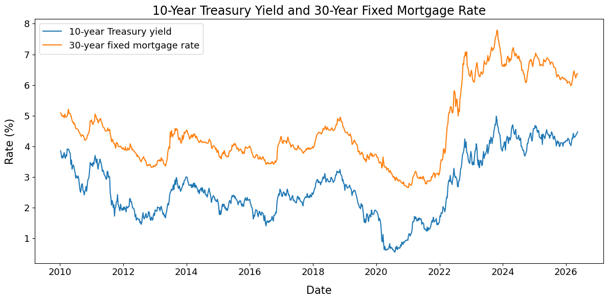
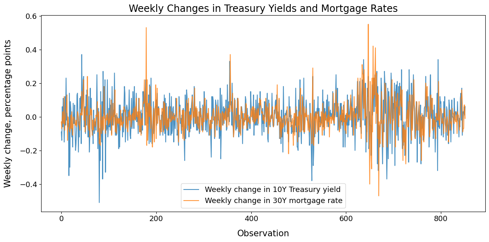
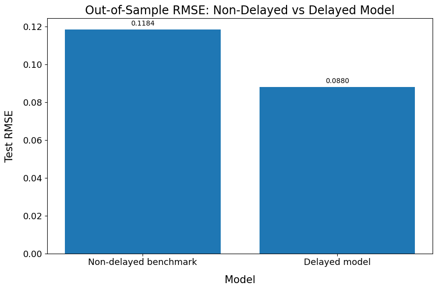
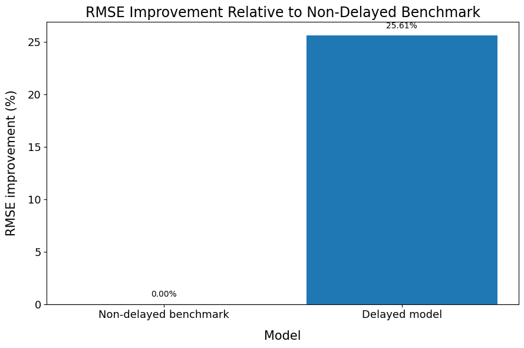
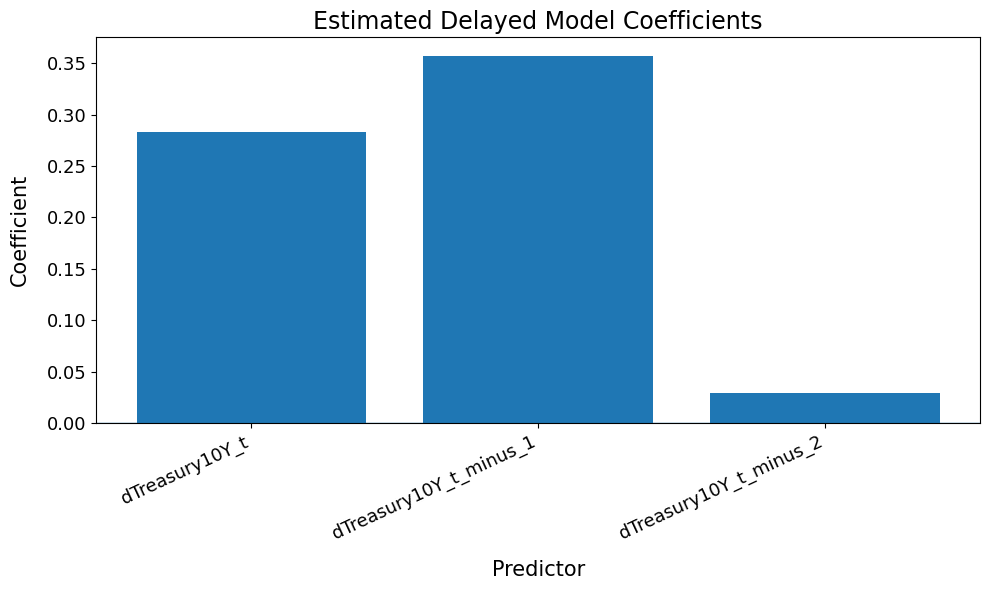
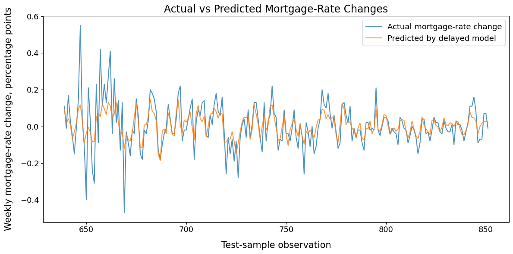

# Delayed Transmission in Mortgage Rates Regression Model

This project investigates whether adding multiple constant time-delays can improve the predictive power of a standard memoryless model in a simple fixed-income setting. The motivating question is:

> Do past Treasury-yield movements improve mortgage-rate prediction better than a non-delayed model?

Using weekly U.S. interest-rate data, it is shown that the fixed-delay model reduces out-of-sample root mean squared error (RMSE) by **26.06%** relative to the non-delayed benchmark. In simple terms, allowing the model to remember past yield movements helps explain mortgage-rate behaviour more accurately than using only the current yield movement.

## Motivation

Mortgage rates are the interest rates that borrowers pay on home loans. Treasury yields are interest rates on government bonds, and they help shape the broader cost of borrowing in the economy. Mortgage rates are therefore closely linked to Treasury yields, but the relationship may not be immediate. When Treasury yields move, mortgage rates may adjust not only now but over the following weeks.
 
This project studies a simple example of delayed transmission: the pass-through from the **10-year Treasury yield** to the **30-year fixed mortgage rate**.

To test this, I compare a no-delay benchmark with a fixed-delay model that includes one-week and two-week lagged Treasury-yield changes. The aim is to see whether adding delayed information improves out-of-sample prediction of mortgage-rate changes.

## Non-Delayed Benchmark

The non-delayed benchmark is a simple linear regression model. It predicts this week’s change in the average 30-year fixed mortgage rate using the change in the 10-year Treasury yield over the same week. Let $m_t$ denote the average rate offered on 30-year fixed mortgages in week $t$ and $y^{10Y}_t$ the 10-year Treasury yield in week $t$. The model is fitted to weekly changes, that is,

$$\Delta m_t=m_t-m_{t-1}$$

and

$$\Delta y^{10Y}_t = y^{10Y}_t - y^{10Y}_{t-1}.$$

The non-delayed model is given by

$$\Delta m_t=c+\beta_0\Delta y^{10Y}_t+\epsilon_t,$$

where $c\in\mathbb{R}$ is the intercept, $\epsilon_t$ is the model error and $\beta_0$ measures the estimated same-week relationship between Treasury-yield changes and mortgage-rate changes.

In simple terms, this model asks how much of this week’s mortgage-rate movement can be explained by this week’s Treasury-yield movement. It is called non-delayed because it does not include Treasury-yield changes from previous weeks. The model acts as the benchmark as the delayed model is only useful if adding lagged Treasury-yield changes improves on this simpler memoryless model.

## Delayed Model

The delayed model extends the non-delayed benchmark by allowing mortgage-rate changes to depend on Treasury-yield movements from previous weeks. The model is given by

$$ \Delta m_t=c+\beta_0\Delta y^{10}_t+\beta_1\Delta y^{10Y}_{t-1}+\beta_2\Delta y^{10Y}_{t-2}+\epsilon_t,$$

where $\Delta y^{10Y}_{t-i}$ denotes the change in the 10-year Tresury yield $i$ weeks ago and $\beta_i$ measure the estimated relationship between mortgage-rate changes and Treasury-yield changes at different time delays.

In simple terms, the model asks whether this week’s mortgage-rate movement can be better explained by using not only this week’s Treasury-yield movement, but also Treasury-yield movements from one and two weeks earlier. This is referred to as a delayed model because the delays are chosen in advance. In this project, the fixed delays are one week and two weeks. The purpose of the model is to test whether mortgage rates adjust gradually rather than all at once. If the delayed model reduces out-of-sample prediction error, then the lagged Treasury-yield terms contain information that the non-delayed benchmark misses.

This means that mortgage-rate changes are better explained by a combination of current and lagged Treasury-yield changes than by current Treasury-yield changes alone.

## Data Overview

The model is fitted using U.S. interest-rate data from Federal Reserve Economic Data (FRED), a public database maintained by the Federal Reserve Bank of St. Louis. The target variable is the weekly change in the 30-year fixed mortgage rate, while the explanatory variable is the weekly change in the 10-year Treasury yield.

  

Plot 1 shows the level of the 10-year Treasury yield and the 30-year fixed mortgage rate over the sample period. The two rates move together over time, which motivates using Treasury-yield movements to explain mortgage-rate movements.

  

Plot 2 shows the weekly changes used in the regression models. The models are fitted to changes rather than levels because the goal is to explain how movements in Treasury yields pass through to movements in mortgage rates.

## Results

The delayed model improves the non-delayed benchmark. The comparison is made out of sample, which means the models are fitted on an earlier training period and evaluated on a later test period that was not used for fitting.

The non-delayed benchmark is

$$\Delta m_t = c+\beta_0\Delta y^{10Y}_t+\varepsilon_t.$$

The delayed model is

$$\Delta m_t = c+\beta_0\Delta y^{10Y}_t+\beta_1\Delta y^{10Y}_{t-1}+\beta_2\Delta y^{10Y}_{t-2}+\varepsilon_t.$$

The delayed model reduces out-of-sample  root mean squared error (RMSE) by **25.61%** relative to the non-delayed benchmark.

  

Plot 3 shows that the delayed model has lower out-of-sample prediction error than the non-delayed benchmark.

  

Plot 4 summarises the key result: adding delayed Treasury-yield terms reduces out-of-sample RMSE by **25.61%**.

## Estimated Delayed Effects

The estimated delayed model coefficients are:

| Predictor | Coefficient | Interpretation |
|---|---:|---|
| \(\Delta y^{10Y}_t\) | 0.283 | Same-week Treasury-yield movement affects mortgage-rate changes |
| \(\Delta y^{10Y}_{t-1}\) | 0.357 | One-week lagged Treasury-yield movement has the largest estimated effect |
| \(\Delta y^{10Y}_{t-2}\) | 0.029 | Two-week lagged Treasury-yield movement has a smaller additional effect |

  

Plot 5 shows how the estimated response is distributed across the current week and previous weeks. The one-week lag has the largest estimated coefficient, which supports the delayed-transmission interpretation.

## Actual versus Predicted Mortgage-Rate Changes

  

Plot 6 compares actual weekly mortgage-rate changes with the delayed model’s predictions over the test period. The model is deliberately simple, but the out-of-sample improvement shows that lagged Treasury-yield changes add useful information beyond the non-delayed benchmark.
